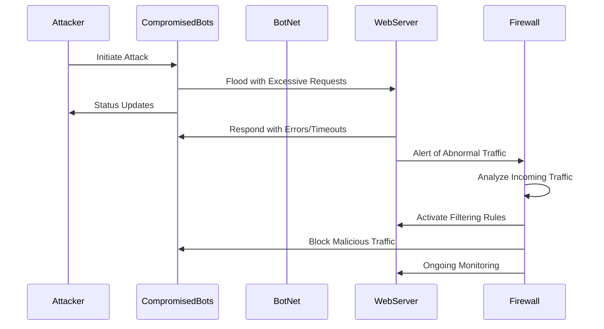

# DDoS_Attack_Sequence.md.

## Daniel Mahler 

# Explanation of Diagram 

### 1. The attacker initiates the attack to the server and the compromised bots receive instructions.
### 2. The compromised bots from the attacker receive the specific instructions and flood the server with excessive requests, an attempt to overwhelm the server. 
### 3. The server under attack receives the overwhelming requests and responds with an error timeout to the bots, due to the high frequency of requests.
### 4. The targeted server then sends alerts about abnormal traffic and identifies risk for attack patterns.
### 5. The firewall begins to activate filtering and identify which bots are trying to attack the server.
### 6. The firewall then identifies these bots and blocks any malicious traffic to the server and continues ongoing monitoring for future / current attacks to the server. 

